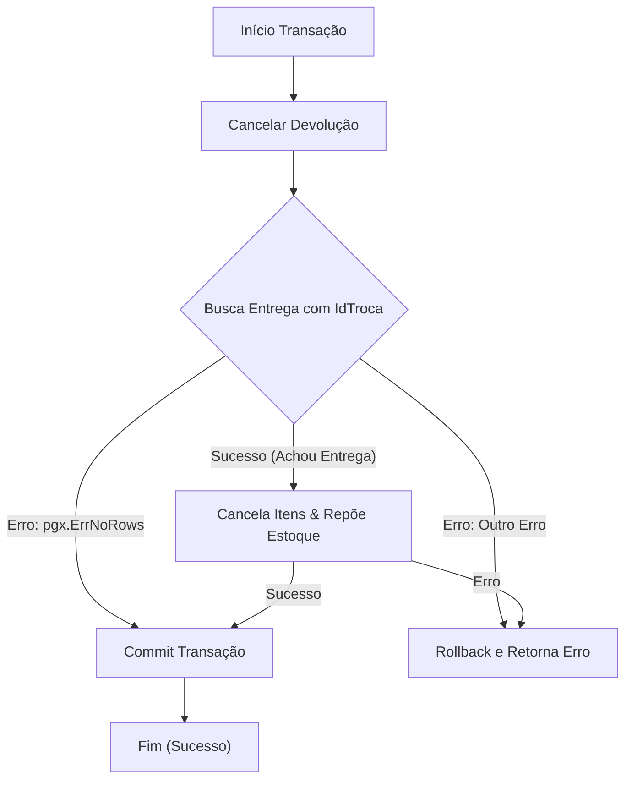

## Documentação: Fluxo de Cancelamento de Devolução

### Descrição Geral
Este diagrama ilustra o fluxo transacional do processo de cancelamento de uma devolução no sistema de gestão de EPI. O fluxo inclui validações, tratamento de erros e operações de reversão de estoque.

### Etapas do Fluxo

1. **Início da Transação (A)**
    - Inicia uma transação de banco de dados para garantir consistência

2. **Cancelamento de Devolução (B)**
    - Executa a operação de cancelamento da devolução

3. **Busca da Entrega (C)** - Ponto de Decisão
    - Consulta a entrega usando o identificador `IdTroca`
    - Três caminhos possíveis:

4. **Tratamento de Erros (C)**
    - **pgx.ErrNoRows**: Nenhuma entrega encontrada → Commit da transação (sem alterações)
    - **Outro Erro**: Falha na consulta → Rollback e retorno do erro

5. **Cancelamento de Itens e Reposição (D)**
    - Se a entrega for encontrada:
      - Cancela os itens da devolução
      - Repõe o estoque correspondente
    - Dois caminhos possíveis:

6. **Finalização (F, G, H)**
    - **Sucesso (D)**: Commit da transação → Fim com sucesso
    - **Erro (D)**: Rollback da transação → Retorno do erro

### Palavras-chave
- Transação atômica
- Tratamento de exceções
- Rollback e Commit
- Gestão de estoque
#  Fluxo de Devolução
## Fluxo da função de cancelar uma devolucao



## Fluxo de Devolução de EPI

Este diagrama representa o processo completo de devolução de Equipamentos de Proteção Individual (EPI), incluindo validações, gerenciamento de estoque e tratamento de transações.

### Etapas Principais

1. **Inicialização da Transação**
    - Inicia uma transação para garantir consistência dos dados
    - Cria um contexto de transação (qtx)

2. **Validação de Troca**
    - Verifica se a devolução é uma troca de EPI
    - Se for troca: valida o novo EPI antes de prosseguir
    - Rollback automático em caso de validação inválida

3. **Lógica de Estoque**
    - Determina o motivo da devolução (descarte ou devolução normal)
    - **Descarte**: item é removido do estoque
    - **Devolução Normal**: item é reintegrado ao estoque

4. **Registro de Entrega (para Trocas)**
    - Se for uma troca, registra a entrega do novo EPI
    - Rollback em caso de erro no registro

5. **Finalização**
    - Commit da transação em caso de sucesso
    - Rollback automático em qualquer erro durante o processo

### Tratamento de Erros
Todas as operações críticas (validação, reposição, salvamento e registro) possuem tratamento de erro com rollback automático da transação.

```mermaid
flowchart TD
    Start([Início]) --> Tx[Iniciar Transação]
    Tx --> Qtx[Criar qtx]

    %% 1. Preparação de Variáveis
    Qtx --> CheckTroca1{É Troca?}
    CheckTroca1 -- Sim --> Valida{Validar Novo EPI}
    Valida -- Inválido --> Rollback[Rollback & Erro]
    Valida -- Válido --> Vars[Preparar Variáveis]
    
    CheckTroca1 -- Não --> CheckDescarte
    Vars --> CheckDescarte

    %% 2. Lógica de Estoque
    CheckDescarte{Motivo é Descarte?}
    CheckDescarte -- Não --> Repor[Devolver Item ao Estoque]flowchart TD
    Start([Início]) --> Tx[Iniciar Transação]
    Tx --> Qtx[Criar qtx com Transação]
    
    %% Início da Lógica de RegistrarEntrega
    Qtx --> BuscaFunc[Busca Funcionário]
    BuscaFunc --> Token[Gerar Token Auditoria]
    Token --> SaveHeader[Salvar Cabeçalho da Entrega\n(Tabela entrega_epi)]
    
    SaveHeader -- Erro --> Rollback
    SaveHeader -- Sucesso --> LoopItens{Há Itens na Lista?}

    %% LOOP EXTERNO: ITENS SOLICITADOS
    subgraph LoopItensGraph [Loop: Processar Itens]
        LoopItens -- Sim --> GetLotes[Listar Lotes Disponíveis\n(Ordenado por Data/Validade)]
        
        GetLotes --> CheckLotes{Existem Lotes?}
        CheckLotes -- Não --> ErroEstoque[Erro: Estoque Insuficiente]
        
        CheckLotes -- Sim --> LoopLotes{Qtd Necessária > 0?}
        
        %% LOOP INTERNO: CONSUMO DE LOTES (FIFO)
        subgraph LoopLotesGraph [Loop Interno: Abater Lotes]
            LoopLotes -- Sim --> Calc[Calc. Qtd a Abater\n(Mínimo entre Lote e Necessário)]
            Calc --> SaveItem[Salvar Item Entregue\n(Vincula ao ID da Entrada)]
            
            SaveItem -- Erro --> Rollback
            SaveItem -- Sucesso --> UpdateEstoque[Abater Estoque da Entrada]
            
            UpdateEstoque -- Erro --> Rollback
            UpdateEstoque -- Sucesso --> Decrement[Subtrair Qtd Necessária]
            Decrement --> LoopLotes
        end
        
        LoopLotes -- Não (Satisfeito) --> CheckFinalItem{Sobrou Necessidade?}
        CheckFinalItem -- Sim (Acabaram os lotes) --> ErroEstoque
        CheckFinalItem -- Não --> LoopItens
    end

    %% Finalização
    ErroEstoque --> Rollback[Rollback & Retornar Erro]
    LoopItens -- Não (Todos Processados) --> Commit[Commit Transação]
    
    Commit --> Fim([Fim (Sucesso)])
    Repor -- Erro --> Rollback
    
    CheckDescarte -- Sim --> SaveDev
    Repor --> SaveDev[Salvar Devolução]

    %% 3. Salvar Devolução e Entrega
    SaveDev -- Erro --> Rollback
    SaveDev --> CheckTroca2{É Troca?}

    CheckTroca2 -- Sim --> RegEntrega[Registrar Entrega]
    RegEntrega -- Erro --> Rollback
    RegEntrega --> Commit

    CheckTroca2 -- Não --> Commit[Commit Transação]

    Commit --> Fim([Fim])
```