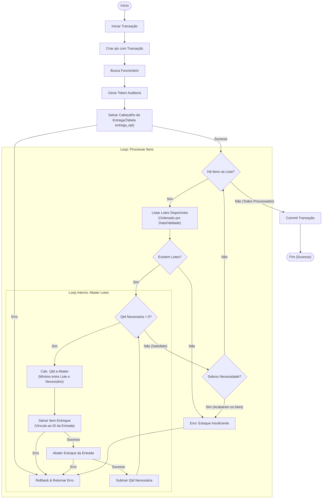
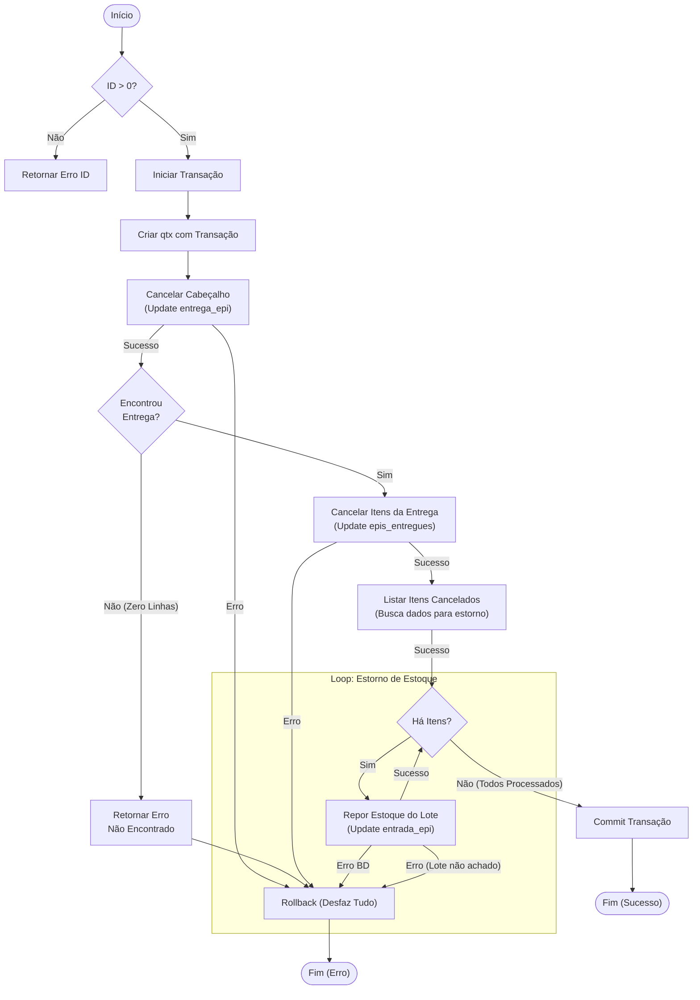

## Fluxo de Registro de Entrega de EPI

Este diagrama apresenta o fluxo completo do processo de registrar uma entrega de Equipamento de Proteção Individual (EPI) com controle transacional e gerenciamento de estoque.

### Componentes Principais

**Inicialização:**
- Inicia uma transação no banco de dados
- Cria um contexto de transação (qtx) para garantir consistência
- Busca os dados do funcionário destinatário
- Gera um token de auditoria para rastreamento

**Cabeçalho da Entrega:**
- Salva o registro principal da entrega na tabela `entrega_epi`
- Valida integridade antes de prosseguir com itens

**Loop Externo - Processamento de Itens:**
- Itera sobre cada item solicitado na entrega
- Para cada item, busca lotes disponíveis ordenados por data/validade (FIFO)
- Valida disponibilidade de estoque antes de processar

**Loop Interno - Consumo de Lotes (FIFO):**
- Implementa abatimento de estoque por lote usando estratégia First-In-First-Out
- Calcula quantidade a abater (menor entre disponível no lote e necessário)
- Salva registro de item entregue vinculado ao ID de entrada
- Atualiza estoque decrementando quantidade do lote
- Continua até satisfazer quantidade necessária do item

**Tratamento de Erros:**
- Valida existência de estoque em cada etapa
- Realiza rollback em caso de erro (garante transação atômica)
- Retorna mensagem de erro específico (estoque insuficiente)

**Finalização:**
- Commit da transação se todos os itens forem processados com sucesso
- Retorna confirmação da entrega completada

## RegistrarCancelamento - Fluxo de Processo

Este diagrama descreve o fluxo de cancelamento de uma entrega de EPI, incluindo validações, transações de banco de dados e reposição de estoque.

### Fluxo Principal

1. **Validação Inicial**: Verifica se o ID da entrega é válido (> 0)
2. **Transação**: Inicia uma transação de banco de dados para garantir consistência
3. **Cancelamento do Cabeçalho**: Atualiza o status da entrega como cancelada
4. **Cancelamento dos Itens**: Marca todos os itens da entrega como cancelados
5. **Reposição de Estoque**: Loop que repõe o estoque de cada lote associado aos itens cancelados
6. **Confirmação**: Commit da transação se todos os passos forem bem-sucedidos

### Tratamento de Erros

- **ID Inválido**: Retorna erro se ID ≤ 0
- **Entrega Não Encontrada**: Retorna erro se nenhum registro for atualizado
- **Erro de Banco de Dados**: Rollback da transação em caso de falha em qualquer operação de atualização
- **Lote Não Encontrado**: Rollback se o lote de reposição não existir

### Garantias

- **ACID**: Transação garante atomicidade - sucesso total ou falha total (rollback)
- **Estorno Completo**: Todos os itens cancelados têm seu estoque reposto
